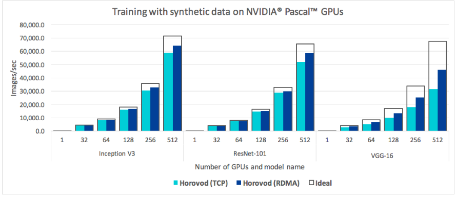
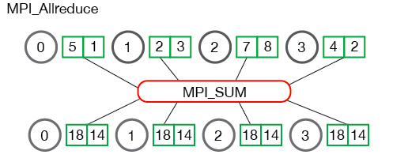

# Horovod  
2019-04-05  
### 目录  
* imgs -->笔记图片
* notes-->笔记   
  
Horovod是TensorFlow，Keras，PyTorch和MXNet的分布式训练框架。Horovod的目标是使分布式深度学习快速且易于使用。  
  
Horovod由Linux Foundation Deep Learning（[LF DL](https://lfdl.io/)）主持。如果您是一家致力于在人工智能，机器和深度学习中使用开源技术，并希望支持这些领域的开源项目社区的公司，请考虑加入LF深度学习基金会。有关谁参与以及Horovod如何扮演角色的详细信息，请阅读LF DL [公告](https://lfdl.io/press-release/2018/12/13/lf-deep-learning-welcomes-horovod-distributed-training-framework-as-newest-project/)。 

  
## 一、资源
官网：https://github.com/horovod/horovod  
官方Tutorial：https://github.com/horovod/tutorials  
MPI:https://www.mpi-forum.org/  

## 二、阅读官方GitHub笔记  
### 1. 为什么不传统的分布式TensorFlow？
该项目的主要动机是使单GPU TensorFlow程序变得容易并且可以更快地在许多GPU上成功训练它。这有两个方面：
* （1）必须对程序进行多少修改才能使其分发，以及运行它有多容易。
* （2）它在分布式模式下运行的速度有多快？  
  
在Uber内部，我们发现MPI模型要比使用参数服务器的Distributed TensorFlow要简单得多，并且需要的代码更改要少得多。

除了易于使用，Horovod很快。下面的图表表示在128台服务器上完成的基准测试，其中4台Pascal GPU均由具有RoCE功能（RoCE（RDMA over Converged Ethernet）是一种允许通过以太网使用远程直接内存访问（RDMA）的网络协议。）的25 Gbit / s网络连接：  
  
Horovod为Inception V3和ResNet-101实现了90％的扩展效率，并为VGG-16实现了68％的扩展效率.  
  
虽然安装MPI和NCCL本身似乎是一件额外的麻烦，但只需要由处理基础设施的团队完成一次，而建立模型的公司中的其他人都可以享受大规模培训的简单性。  
  
### 2.安装  
* (1).[Docker](notes/docker.md)  
* (2).[主机](notes/computer.md)  
### 3.概念  
Horovod核心原则基于[MPI](https://www.mpi-forum.org/)概念，例如size（大小）, rank（排名）, local rank（本地排名）, allreduce, allgather and broadcast.    
**[举个栗子](http://mpitutorial.com/tutorials/mpi-reduce-and-allreduce/)**，假设我们在4台服务器上启动了一个训练脚本，每台服务器都有4个GPU。如果我们为每个GPU启动一个脚本副本：  
* size是进程数，在本例中为16。
* Rank是从0到15（size -1）的唯一进程ID 。
* local rank是服务器中从0到3的唯一进程ID。
* Allreduce是一种在多个进程之间聚合数据并将结果分发回给它们的操作。 Allreduce用于平均密集张量。  
  
* Allgather是一个从每个进程的所有进程收集数据的操作。 Allgather用于收集稀疏张量的值。  
  
* 广播是一种操作，它将来自一个进程的数据（由根级别标识）广播到每个其他进程。  
  
### 4.如何使用Horovod  
要使用Horovod，请为您的程序添加以下内容：
* （1）hvd.init()
* （2）进程使用`config.gpu_options.visible_device_list`方法固定要使用的服务器GPU。通过每个进程一个GPU的典型设置，可以将其设置为本地排名。在这种情况下，服务器上的第一个进程将被分配第一个GPU，第二个进程将被分配第二个GPU，依此类推。
* （3）根据worker数量来扩大学习率。同步分布式训练中的有效批量大小按worker数量进行调整。学习率的增加补偿了批量增​​加的规模。
* （4）包装优化器`hvd.DistributedOptimizer`。分布式优化器将梯度计算委托给原始优化器，使用allreduce或allgather平均渐变，然后应用这些平均梯度。
* （5）添加`hvd.BroadcastGlobalVariablesHook(0)`到从0级到所有其他进程的广播初始变量状态。这对于确保在使用随机权重开始训练或从检查点恢复时所有工作人员的一致初始化是必要的。或者，如果您不使用`MonitoredTrainingSession`，则可以`hvd.broadcast_global_variables`在初始化全局变量后执行op。
* （6）修改代码以仅在worker 0上保存检查点，以防止其他工作人员破坏它们。这可以通过传递checkpoint_dir=None到tf.train.MonitoredTrainingSessionif 来实现hvd.rank() != 0。 
  
```python
import tensorflow as tf
import horovod.tensorflow as hvd


# Initialize Horovod
hvd.init()

# Pin GPU to be used to process local rank (one GPU per process)
config = tf.ConfigProto()
config.gpu_options.visible_device_list = str(hvd.local_rank())

# Build model...
loss = ...
opt = tf.train.AdagradOptimizer(0.01 * hvd.size())

# Add Horovod Distributed Optimizer
opt = hvd.DistributedOptimizer(opt)

# Add hook to broadcast variables from rank 0 to all other processes during
# initialization.
hooks = [hvd.BroadcastGlobalVariablesHook(0)]

# Make training operation
train_op = opt.minimize(loss)

# Save checkpoints only on worker 0 to prevent other workers from corrupting them.
checkpoint_dir = '/tmp/train_logs' if hvd.rank() == 0 else None

# The MonitoredTrainingSession takes care of session initialization,
# restoring from a checkpoint, saving to a checkpoint, and closing when done
# or an error occurs.
with tf.train.MonitoredTrainingSession(checkpoint_dir=checkpoint_dir,
                                       config=config,
                                       hooks=hooks) as mon_sess:
  while not mon_sess.should_stop():
    # Perform synchronous training.
    mon_sess.run(train_op)
```
### 5.运行Horovod  
* （1）[Tensorflow](notes/tensorflow.md)
* （2）[MxNet](notes/mxnet.md)
* （3）[Pytorch](notes/pytorch.md)
* （4）[Keras](notes/keras.md)

 
