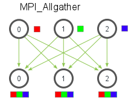
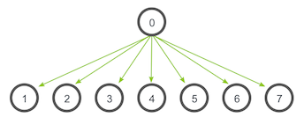

# 分布式训练系统架构
系统架构层包括两种架构：  
* Parameter Server Architecture（就是常见的PS架构，参数服务器）  
* Ring-allreduce Architecture  
  
## 1.Parameter server架构  
在Parameter server架构（PS架构）中，集群中的节点被分为两类：**parameter server**和**worker**。其中parameter server存放模型的参数，而worker负责计算参数的梯度。在每个迭代过程，worker从parameter sever中获得参数，然后将计算的梯度返回给parameter server，parameter server聚合从worker传回的梯度，然后更新参数，并将新的参数广播给worker。  
PS架构是深度学习最常采用的分布式训练架构。采用同步SGD方式的PS架构如下图所示：
  
## 2.Ring-allreduce架构
在Ring-allreduce架构中，各个设备都是worker，并且形成一个环，如下图所示，没有中心节点来聚合所有worker计算的梯度。在一个迭代过程，每个worker完成自己的mini-batch训练，计算出梯度，并将梯度传递给环中的下一个worker，同时它也接收从上一个worker的梯度。对于一个包含N个worker的环，各个worker需要收到其它N-1个worker的梯度后就可以更新模型参数。其实这个过程需要两个部分：scatter-reduce和allgather，百度的教程对这个过程给出了详细的图文解释。百度开发了自己的allreduce框架，并将其用在了深度学习的分布式训练中。
  
相比PS架构，Ring-allreduce架构是带宽优化的，因为集群中每个节点的带宽都被充分利用。此外，在深度学习训练过程中，计算梯度采用BP算法，其特点是后面层的梯度先被计算，而前面层的梯度慢于前面层，Ring-allreduce架构可以充分利用这个特点，在前面层梯度计算的同时进行后面层梯度的传递，从而进一步减少训练时间。在百度的实验中，他们发现训练速度基本上线性正比于GPUs数目（worker数）。

一般的多卡gpu训练有一个很大的缺陷，就是因为每次都需要一个gpu（cpu）从其他gpu上收集训练的梯度，然后将新的模型分发到其他gpu上。这样的模型最大的缺陷是gpu 0的通信时间是随着gpu卡数的增长而线性增长的。

所以就有了ring-allreduce，如下图：
  
该算法的基本思想是取消Reducer，让数据在gpu形成的环内流动，整个ring-allreduce的过程分为两大步，第一步是scatter-reduce，第二步是allgather。

先说第一步：首先我们有n块gpu，那么我们把每个gpu上的数据（均等的）划分成n块，并给每个gpu指定它的左右邻居（图中0号gpu的左邻居是4号，右邻居是1号，1号gpu的左邻居是0号，右邻居是2号……），然后开始执行n-1次操作，在第i次操作时，gpu j会将自己的第(j - i)%n块数据发送给gpu j+1，并接受gpu j-1的(j - i - 1)%n块数据。并将接受来的数据进行reduce操作，示意图如下：
  
当n-1次操作完成后，ring-allreduce的第一大步scatter-reduce就已经完成了，此时，第i块gpu的第(i + 1) % n块数据已经收集到了所有n块gpu的第(i + 1) % n块数据，那么，再进行一次allgather就可以完成算法了。

第二步allgather做的事情很简单，就是通过n-1次传递，把第i块gpu的第(i + 1) % n块数据传递给其他gpu，同样也是在i次传递时，gpu j把自己的第(j - i - 1)%n块数据发送给右邻居，接受左邻居的第(j - i - 2) % n数据，但是接受来的数据不需要像第一步那样做reduce，而是直接用接受来的数据代替自己的数据就好了。

最后每个gpu的数据就变成了这样：
  
首先是第一步，scatter-reduce：  
    

然后是allgather的例子：  
  
Horovod 是 Uber 开源的又一个深度学习工具，它的发展吸取了 Facebook「一小时训练 ImageNet 论文」(《Accurate, Large Minibatch SGD: Training ImageNet in 1 Hour 》)与百度 Ring Allreduce 的优点，可为用户实现分布式训练提供帮助。本文将简要介绍这一框架的特性。    
Deep Learning training说白了是浮点数运算，非常适合以MPI为核心的并行计算。之前Google，百度，以及Facebook那篇ImageNet in one hour也用的是MPI。   
以Spark为核心的编程模型比较适合于数据中心处理streaming之类的操作，一般在计算类应用中要比MPI慢的多。
