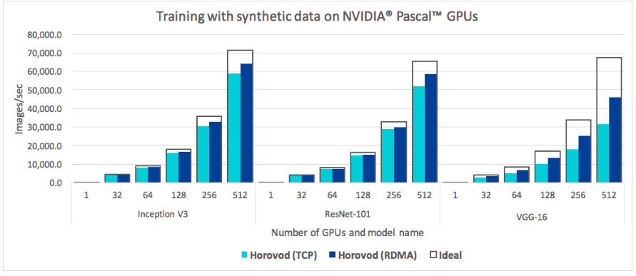

# Horovod介绍 
Horovod是TensorFlow，Keras，PyTorch和MXNet的分布式训练框架。Horovod的目标是使分布式深度学习快速且易于使用。  
  
Horovod由Linux Foundation Deep Learning（[LF DL](https://lfdl.io/)）主持。如果您是一家致力于在人工智能，机器和深度学习中使用开源技术，并希望支持这些领域的开源项目社区的公司，请考虑加入LF深度学习基金会。有关谁参与以及Horovod如何扮演角色的详细信息，请阅读LF DL [公告](https://lfdl.io/press-release/2018/12/13/lf-deep-learning-welcomes-horovod-distributed-training-framework-as-newest-project/)。 

 
## 1. 为什么不传统的分布式TensorFlow？
该项目的主要动机是使单GPU TensorFlow程序变得容易并且可以更快地在许多GPU上成功训练它。这有两个方面：
* （1）必须对程序进行多少修改才能使其分发，以及运行它有多容易。
* （2）它在分布式模式下运行的速度有多快？  
  
在Uber内部，我们发现MPI模型要比使用参数服务器的Distributed TensorFlow要简单得多，并且需要的代码更改要少得多。

除了易于使用，Horovod很快。下面的图表表示在128台服务器上完成的基准测试，其中4台Pascal GPU均由具有RoCE功能（RoCE（RDMA over Converged Ethernet）是一种允许通过以太网使用远程直接内存访问（RDMA）的网络协议。）的25 Gbit / s网络连接：  
  
Horovod为Inception V3和ResNet-101实现了90％的扩展效率，并为VGG-16实现了68％的扩展效率.  
  
虽然安装**MPI和NCCL**本身似乎是一件额外的麻烦，但只需要由处理基础设施的团队完成一次，而建立模型的公司中的其他人都可以享受大规模培训的简单性。  

 
## 2.概念  
Horovod核心原则基于MPI概念，例如size（大小）, rank（排名）, local rank（本地排名）, allreduce, allgather and broadcast.        
假设我们在4台服务器上启动了一个训练脚本，每台服务器都有4个GPU。如果我们为每个GPU启动一个脚本副本：  
* size是进程数，在本例中为16。
* Rank是从0到15（size -1）的唯一进程ID 。
* local rank是服务器中从0到3的唯一进程ID。
* Allreduce是一种在多个进程之间聚合数据并将结果分发回给它们的操作。 Allreduce用于平均密集张量。  
  
* Allgather是一个从每个进程的所有进程收集数据的操作。 Allgather用于收集稀疏张量的值。  
  
* 广播是一种操作，它将来自一个进程的数据（由根级别标识）广播到每个其他进程。  
  
