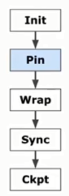
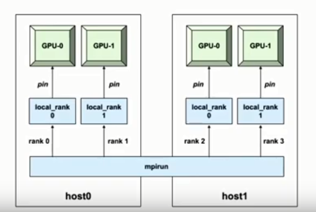
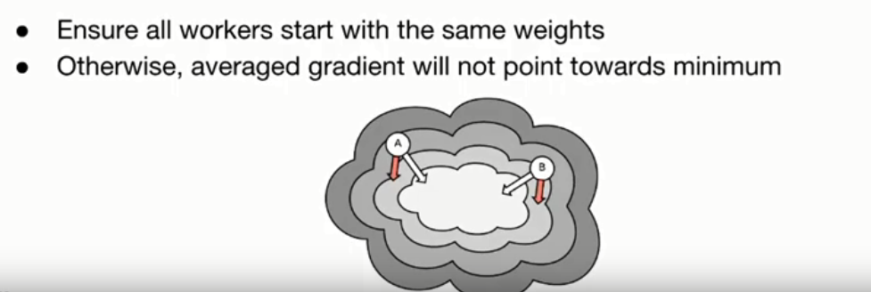

# 一、如何使用Horovod  
## 概述
要使用Horovod，请为您的程序添加以下内容：
* （1）hvd.init()
* （2）进程使用`config.gpu_options.visible_device_list`方法固定要使用的服务器GPU。通过每个进程一个GPU的典型设置，可以将其设置为`local rank`。在这种情况下，服务器上的第一个进程将被分配第一个GPU，第二个进程将被分配第二个GPU，依此类推。
* （3）根据worker数量来扩大学习率。同步分布式训练中的有效批量大小按worker数量进行调整。学习率的增加补偿了批量增​​加的规模。
* （4）包装优化器`hvd.DistributedOptimizer`。分布式优化器将梯度计算委托给原始优化器，使用allreduce或allgather平均渐变，然后应用这些平均梯度。
* （5）添加`hvd.BroadcastGlobalVariablesHook(0)`到从0级到所有其他进程的广播初始变量状态。这对于确保在使用随机权重开始训练或从检查点恢复时所有工作人员的一致初始化是必要的。或者，如果您不使用`MonitoredTrainingSession`，则可以`hvd.broadcast_global_variables`在初始化全局变量后执行op。
* （6）修改代码以仅在worker 0上保存检查点，以防止其他工作人员破坏它们。这可以通过传递checkpoint_dir=None到tf.train.MonitoredTrainingSessionif 来实现hvd.rank() != 0。 
  
详细介绍：  
  

## 1. Initialize  the library  
```python
import horovod.tensorflow as hvd
hvd.init()
```
## 2. Pin a GPU for each worker  
```python
config = tf.ConfigProto()
config.gpu_options.visible_device_list = str(hvd.local_rank())
```
   
## 3. Adjust learning rate and wrap the optimizer  
```python
opt = tf.train.MomentumOptimizer(lr=0.01 * hvd.size()) 
opt = hvd.DistributedOptimizer(opt)
```
## 4. Synchronize state across workers  
```python
hooks = [hvd.BroadcastGloabalVarablesHook(0)]
with tf.train.MonitoredTrainingSession(hooks=hooks,...) as mon_sess:
```
  
## 5. Checkpoint on the first worker  
```python
ckpt_dir = "/temp/train_logs" if hvd.rank() == 0 else None
with tf.train.MonitoredTrainingSession(
  checkpoint_dir=ckpt_dir,...) as mon_sess:
```   

# 二、运行Horovod的环境  
在以下每个环境下，都有**单机多卡**和**多机多卡**两种情况。   
  
* 1. 主机上
* 2. Docker  
* 3. Kubeflow  
* 4. MPI Operator
* 5. Helm Chart
* 6. FfDL
* 7. Spark   
  
具体测试内容，请参考[benchmark](https://github.com/fusimeng/framework_benchmark)
 
