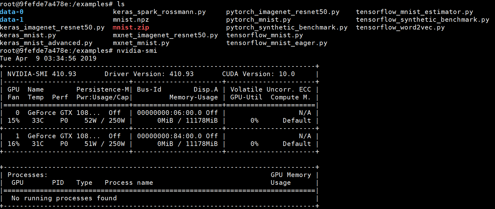

# 单机单卡/多卡测试   
## 一、搭建主机环境和创建horovod镜像   
参考Dockerfile或者在[DockerHub](https://hub.docker.com/r/horovod/horovod)下载镜像。      
```js
FROM nvidia/cuda:9.0-devel-ubuntu16.04

# TensorFlow version is tightly coupled to CUDA and cuDNN so it should be selected carefully
ENV TENSORFLOW_VERSION=1.12.0
ENV PYTORCH_VERSION=1.0.0
ENV CUDNN_VERSION=7.4.1.5-1+cuda9.0
ENV NCCL_VERSION=2.3.7-1+cuda9.0
ENV MXNET_URL=https://s3-us-west-2.amazonaws.com/mxnet-python-packages-gcc5/mxnet_cu90_gcc5-1.4.0-py2.py3-none-manylinux1_x86_64.whl

# Python 2.7 or 3.5 is supported by Ubuntu Xenial out of the box
ARG python=2.7
ENV PYTHON_VERSION=${python}

RUN apt-get update && apt-get install -y --allow-downgrades --allow-change-held-packages --no-install-recommends \
        build-essential \
        cmake \
        git \
        curl \
        vim \
        wget \
        ca-certificates \
        libcudnn7=${CUDNN_VERSION} \
        libnccl2=${NCCL_VERSION} \
        libnccl-dev=${NCCL_VERSION} \
        libjpeg-dev \
        libpng-dev \
        python${PYTHON_VERSION} \
        python${PYTHON_VERSION}-dev

RUN ln -s /usr/bin/python${PYTHON_VERSION} /usr/bin/python

RUN curl -O https://bootstrap.pypa.io/get-pip.py && \
    python get-pip.py && \
    rm get-pip.py

# Install TensorFlow, Keras, PyTorch and MXNet
RUN pip install 'numpy<1.15.0' tensorflow-gpu==${TENSORFLOW_VERSION} keras h5py torch==${PYTORCH_VERSION} torchvision ${MXNET_URL}

# Install Open MPI
RUN mkdir /tmp/openmpi && \
    cd /tmp/openmpi && \
    wget https://www.open-mpi.org/software/ompi/v4.0/downloads/openmpi-4.0.0.tar.gz && \
    tar zxf openmpi-4.0.0.tar.gz && \
    cd openmpi-4.0.0 && \
    ./configure --enable-orterun-prefix-by-default && \
    make -j $(nproc) all && \
    make install && \
    ldconfig && \
    rm -rf /tmp/openmpi

# Install Horovod, temporarily using CUDA stubs
RUN ldconfig /usr/local/cuda-9.0/targets/x86_64-linux/lib/stubs && \
    HOROVOD_GPU_ALLREDUCE=NCCL HOROVOD_WITH_TENSORFLOW=1 HOROVOD_WITH_PYTORCH=1 HOROVOD_WITH_MXNET=1 pip install --no-cache-dir horovod && \
    ldconfig

# Install OpenSSH for MPI to communicate between containers
RUN apt-get install -y --no-install-recommends openssh-client openssh-server && \
    mkdir -p /var/run/sshd

# Allow OpenSSH to talk to containers without asking for confirmation
RUN cat /etc/ssh/ssh_config | grep -v StrictHostKeyChecking > /etc/ssh/ssh_config.new && \
    echo "    StrictHostKeyChecking no" >> /etc/ssh/ssh_config.new && \
    mv /etc/ssh/ssh_config.new /etc/ssh/ssh_config

# Download examples
RUN apt-get install -y --no-install-recommends subversion && \
    svn checkout https://github.com/horovod/horovod/trunk/examples && \
    rm -rf /examples/.svn

WORKDIR "/examples"
```  
## 二、单机多卡运行   
### 1.准备镜像  
使用镜像`fusimeng/ai.horovod:v1 `    
### 2.准备数据    
下载[mnist.npz](https://s3.amazonaws.com/img-datasets/mnist.npz)上传到服务器。  
### 3.准备代码  
参考：https://github.com/horovod/horovod/tree/master/examples  
 
### 4.测试
### (1) [pytorch_mnist.py](../code/pytorch_mnist.py)  
```shell
$nvidia-docker run -it - xxx:xxx fusimeng/ai.horovod:v1
``` 
  
 
```shell
root@xxxx:/examples# horovodrun -np 2 -H localhost:2 python pytorch_mnist.py
```
[日志文件](logs.txt)
### (2)  [mxnet_mnist.py](../code/mxnet_mnist.py)   
```shell
root@9fefde7a478e:/examples# horovodrun -np 2 -H localhost:2 python mxnet_mnist.py
```
[日志文件](mxnet_mnist_logs.txt)


### (3)  [keras_mnist.py](../code/keras_mvim nist.py)  
```shell
root@9fefde7a478e:/examples# horovodrun -np 2 -H localhost:2 python keras_mnist.py
```
[日志文件](keras_mnist_logs.txt)  

### (4)[tensorflow_mnist.py](../code/tensorflow_mnist.py)   

```shell
root@9fefde7a478e:/examples# horovodrun -np 2 -H localhost:2 python tensorflow_mnist.py
```
[日志文件](tensorflow_mnist_logs.txt)

## 封装镜像  
调试不易，封装成`fusimeng/ai.horovod:v2`